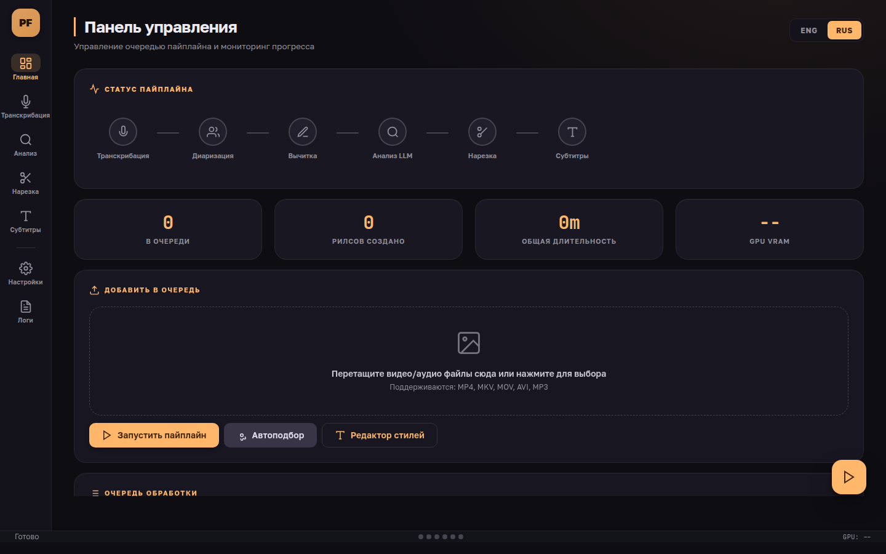
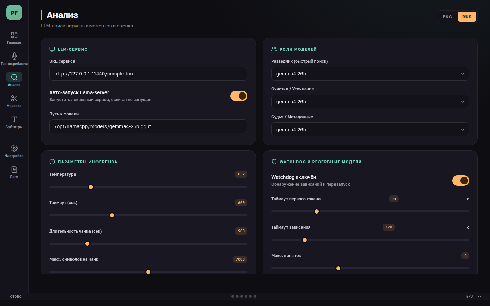
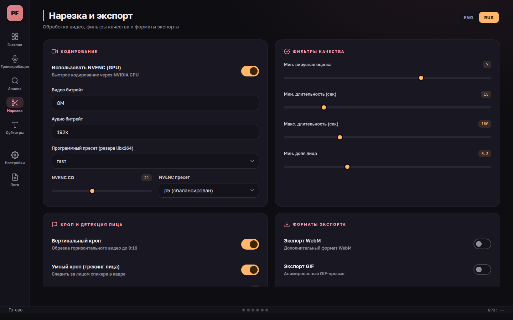
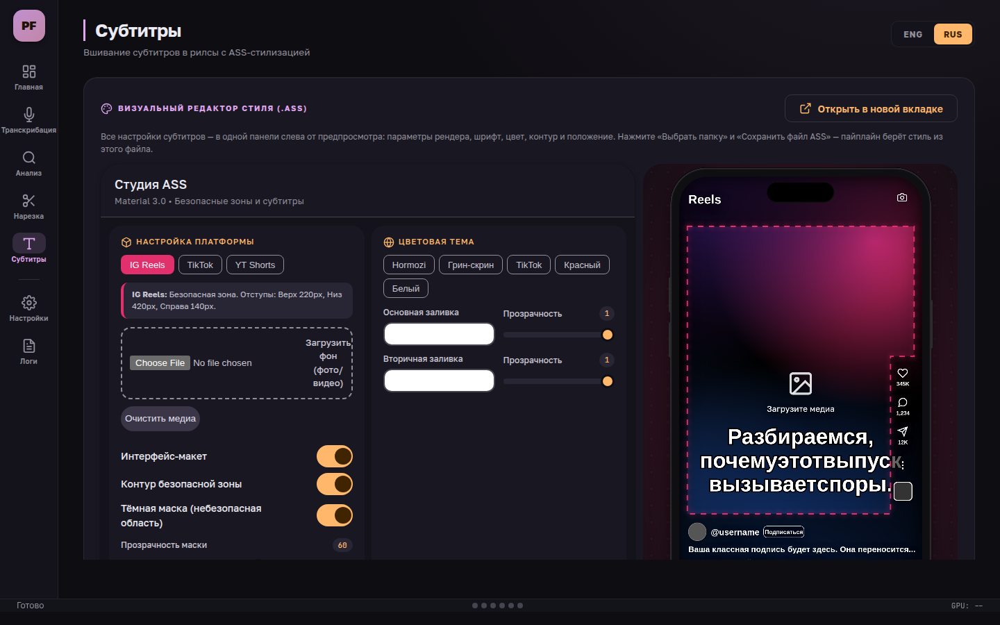

# 🎙️ Podcast Reels Forge

## Automatically create Reels/Shorts from podcasts (local-first)

[](https://www.python.org/downloads/)
[](LICENSE)
[](https://xn--80abidn3bem.xn--p1ai/projects/podcast-reels-forge/)
[](https://dalink.to/bormotoon)

**English** | [Русский](README.md)

🌐 **Project page:** [педобраз.рф/projects/podcast-reels-forge](https://xn--80abidn3bem.xn--p1ai/projects/podcast-reels-forge/)

---

## 📌 Table of Contents

- [What it does](#what-it-does)
- [Key Features](#key-features)
- [Quick Start](#quick-start)
- [Run Modes by Task](#run-modes-by-task)
- [Pipeline Overview](#pipeline-overview)
- [Output Layout](#output-layout)
- [Command Line Arguments](#command-line-arguments)
- [Configuration (config.yaml)](#configuration-configyaml)
- [Graphical Interface (GUI)](#graphical-interface-gui)
- [Face-Aware Smart Crop](#face-aware-smart-crop-optional)
- [Rerendering Videos](#re-render-video-from-existing-momentsjson)
- [Performance and Stability](#performance-and-stability)
- [Support the Project](#support-the-project)
- [License](#license)

---

## What it does

**Podcast Reels Forge** is a powerful CLI tool designed to automatically extract viral short-form content (Reels, Shorts, TikTok) from long-form podcasts or interviews. It handles everything from speech recognition to final video editing.

Main workflow steps:

1. **Speech Recognition (faster-whisper)**: Converts audio/video into text with per-word timestamps. Model `large-v3`, with two modes — fast batched and accurate context-aware (see [Run Modes by Task](#run-modes-by-task)). A sentence-split `.srt` is written alongside it — one short cue per screen instead of a three-or-four-sentence wall of text.
2. **Diarization (Optional)**: Identifies different speakers throughout the audio.
3. **Transcript Proofreading (LLM)**: gemma4 fixes spelling and punctuation; a guardrail rejects any correction that adds, drops or paraphrases text.
4. **Episode long-read (LLM)**: gemma4 edits the proofread transcript into a readable article — meaning-based sections with headings and paragraphs. It is not a retelling: the author's words, phrasing and grammatical person are kept, and only filler, slips and repetitions go. Three guardrails catch rewriting, padding and abridging alike.
5. **AI Analysis (LLM)**: A staged `scout → cleanup → judge` flow on a local Gemma, with candidates verified against the transcript: quote matching, phrase-aligned boundaries, audio signals (loudness/pauses/speech rate) and whole-episode context. The clip count scales with runtime (`clips_per_hour`).
6. **Video Editing (FFmpeg + NVENC)**: Cuts the video, applies vertical cropping (9:16), stabilized face framing, and burns karaoke subtitles timed from real word timestamps. GPU encoding via NVENC (~5× faster than software).

Detailed user guide: [docs/USER_GUIDE.md](docs/USER_GUIDE.md)

---

## Key features

- **Batch Processing**: Drop multiple videos into `input/`, and the forge will process them all sequentially.
- **Two transcription modes**: `fast` (batched, ~5 min per hour of audio) and `quality` (sequential with context, more accurate on quiet/noisy recordings).
- **Hallucination guard**: Suppresses Whisper repetition loops (endless "Thank you." on silence/music) via a temperature ladder, repetition penalty, and `condition_on_previous_text`.
- **Role-based llama.cpp pipeline**: Local staged flow through **llama.cpp** with a Gemma 4 lineup: `gemma4`. Model replies are constrained by a JSON grammar, unparseable JSON is re-asked, and one failed chunk doesn't abort the analysis.
- **Transcript proofreading**: An LLM fixes spelling and punctuation before analysis; a letter-content check guarantees the model added and paraphrased nothing.
- **Episode article**: A detailed, sectioned retelling (`<stem>.article.md`) that reads far better than a transcript. Passages that fail the faithfulness checks are flagged rather than passed off as verified.
- **Clips grounded in reality**: Every candidate's quote is checked against what was actually said; clip bounds snap to the start of a phrase and the end of a thought; hallucinated timecodes are dropped.
- **Audio signals**: Loudness, pause density and speech rate on each candidate's span are measured with ffmpeg and feed the ranking — text heuristics can't hear the episode, these can.
- **Runtime-scaled clip counts**: `clips_per_hour: 10` — a 1.5-hour episode yields ~15 clips; the per-type counters only set the mix.
- **Smart Face Crop**: Automatically detects faces and centers the frame during vertical cropping.
- **Hardware Acceleration**: **CUDA** (ctranslate2) for Whisper and **NVENC** for video rendering. The NVENC-capable ffmpeg is auto-detected.
- **Stall-proof llama.cpp calls**: A total request timeout plus automatic retries; the pipeline rides out even a ten-minute server stall on its own.
- **Flexible Clip Types**: Configure durations and mix for Stories, Reels, Long Reels, and Highlights separately.
- **Honest quality measurement**: `evaluate_prompts` computes recall/precision against a hand-labelled golden set (`golden/<episode>.json`).
- **Browser GUI**: Build `config.yaml` and edit ASS subtitles visually with a bilingual (RU/EN) interface, no server needed — see [Graphical Interface (GUI)](#graphical-interface-gui).

---

## Quick start

### Requirements

- **Python 3.10+**
- **FFmpeg** (must be in PATH)
- **llama.cpp (`llama-server`)** (for local LLM support)
- **NVIDIA GPU** (highly recommended for performance)

### Installation

1. Clone the repository.
2. Create a virtual environment and install dependencies:

```bash
python3 -m venv whisper-env
source whisper-env/bin/activate
pip install -r requirements.txt
```

### Prepare Input

Place your video files (mp4, mkv, mov) in the `input/` directory.
*Tip: If a same-name `mp3` already exists, Forge will use it. Otherwise it automatically extracts audio from the video into `video.mp3` at 320 kbps and continues the pipeline as usual.*

### Run

```bash
python3 start_forge.py
```

---

## Run modes by task

Forge can run end-to-end (full pipeline) or transcription-only. Transcription has two modes — `fast` (default) and `quality`.

| Mode | When to use | Speed\* |
|---|---|---|
| `fast` (batched) | Clean recording, need a quick draft | ~5 min per hour of audio |
| `quality` (sequential, context-aware) | Quiet/far-field/noisy recording (dictaphone, phone, hall): fixes garbled words | ~1 h per hour of audio |

\* Reference for an RTX 5060 Ti 16GB with `large-v3`. Quality mode is slower because it processes segments sequentially with language context instead of independent batches.

### Full pipeline (transcribe → analyze → cut with NVENC)

```bash
python3 start_forge.py                     # transcription mode comes from config.yaml
python3 start_forge.py --verbose           # verbose logs
python3 start_forge.py --no-skip-existing  # rerun all stages, ignore cache
```

For the full pipeline, set the transcription mode in `config.yaml` → `transcription.mode` (`fast`/`quality`).

### Transcription-only for audio in `input/`

```bash
# Fast mode (default)
python3 transcribe_input_audio.py --verbose

# Quality mode + topic hint — greatly improves quiet/noisy recordings
python3 transcribe_input_audio.py --verbose --mode quality \
  --initial-prompt "School parent meeting. Curriculum, classes, teachers."

# Re-transcribe from scratch, ignoring cache
python3 transcribe_input_audio.py --verbose --no-skip-existing
```

> 💡 **Topic hint** (`--initial-prompt`) biases the model's vocabulary and helps in both modes. Provide context specific to the recording.

> 💡 **Audio denoising** in practice **hurts** recognition — Whisper is trained on "dirty" audio. Get gains from quality mode and the topic hint, not from preprocessing.

### Re-render videos without AI analysis

```bash
python3 rerender_videos.py --smart-crop-face --replace
```

### Inspect the result

```bash
python3 - <<'PY'
import json; d=json.load(open('output/<stem>/<stem>.json'))
s=d['segments']
print('mode:', d.get('mode'), '| segments:', len(s))
PY
```

---

## Pipeline overview

The orchestrator [start_forge.py](start_forge.py) runs [podcast_reels_forge/pipeline.py](podcast_reels_forge/pipeline.py), which executes the following stages for each file:

1. **Transcription**: Uses `faster-whisper`. Output: `output/<file_stem>/audio.json` + `audio.srt`.
2. **Diarization**: (If enabled) Creates `diarization.json` with speaker turns.
3. **Proofread**: gemma4 proofreads the transcript (spelling/punctuation) with a guardrail check on every correction. Output: `<file_stem>.proofread.json` + `.srt`; the raw transcript is untouched.
4. **Article**: gemma4 rebuilds the proofread transcript into an article: meaning-based sections, headings, paragraphs. Length and vocabulary checks catch padding; fragments that fail are flagged in `.article.json`. Output: `<file_stem>.article.md` + `.json`.
5. **Analyze (Staged)**: Episode overview → scout over overlapping chunks → cleanup (dedupe/merge) → judge that sees each clip's real opening and closing seconds. Deterministic validation runs between stages: timecode clamping, quote verification against the transcript, boundary snapping to phrases, audio probing. Final selection honours type quotas, overlaps and topic diversity. Artifacts go to `output/<file_stem>/<model>/` (e.g. `gemma4_26b/`).
6. **Video Processing**: Cuts clips from the final `moments.json`. Forge burns ASS subtitles into each reel with ffmpeg, adds a ready-to-post `reel_XX.md`, keeps a local `reel_XX.srt`, and builds `reels_preview.mp4`.


---

## Output layout

Inside the `output/` directory:

```text
output/
  my_podcast/
    my_podcast.json            # Transcript (segments + per-word timestamps)
    my_podcast.srt
    my_podcast.proofread.json  # Proofread transcript (used by analysis and subtitles)
    my_podcast.proofread.srt
    my_podcast.article.md        # Episode retelling, ready to read
    my_podcast.article.json      # Sections, timings and guardrail metadata
    diarization.json           # (Optional) Speaker info
    gemma4_26b/                # Analysis model folder
      analysis_manifest.json   # Run parameters: quotas, chunks, language
      episode_context.json     # Episode overview (cached)
      scout_candidates.json    # Everything the scout found
      cleaned_candidates.json  # After dedupe, cleanup and audio probing
      moments.json             # Final list: score (1-10), priority, quote_match_ratio…
      reels.md                 # Clip summary
      reels/                   # Cut video clips .mp4
        reel_01.srt            # Local subtitle timeline (reference)
        reel_01.md             # Description + 5 hashtags for reel_01.mp4
        rejected/              # Clips that failed quality_filters
      reels_preview.mp4        # Concatenated preview of all clips
```

---

## Command line arguments

Main flags for `start_forge.py`:

- `--config <path>`: Path to config (default: `config.yaml`).
- `--verbose`: Verbose output for all commands and logs.
- `--quiet`: Errors-only mode.
- `--no-skip-existing`: Rerun all stages even if files already exist (ignore cache).
- `--autotune`: Automatically tune parameters for current hardware (smaller chunks, longer timeouts).
- `--no-progress`: Disable progress bar (useful for CI/logging).
- `--only <stages>`: Run only these stages, comma-separated. Example: `--only proofread,article`.
- `--skip <stages>`: Run everything except these stages. Example: `--skip cut`.
- `--list-stages`: Print the stages in order and exit.

Stages: `transcribe`, `diarize`, `proofread`, `article`, `analyze`, `cut`. A typo is an error, not a silent skip of half the pipeline. Skipping a stage does not strand the others: when a proofread transcript already exists from an earlier run, `--only article` picks it up.

```bash
# Build long-reads from existing transcripts without re-cutting anything
python3 start_forge.py --only article

# Everything except video cutting
python3 start_forge.py --skip cut
```

Flags for the standalone transcriber `transcribe_input_audio.py`:

- `--mode <fast|quality>`: Override `transcription.mode` from config.
- `--initial-prompt "<text>"`: Topic hint to bias the model's vocabulary.
- `--verbose` / `--quiet`: Log level.
- `--no-skip-existing`: Re-transcribe even if a JSON already exists.

---

## Configuration (config.yaml)

### Key Sections

- **`transcription`**: Whisper model (`large-v3`), device (`auto`/`cuda`/`cpu`), language.
  - `mode`: `fast` (batched) or `quality` (sequential, more accurate).
  - `batch_size`: batch size in fast mode (default 16; on OOM it auto-halves down to CPU).
  - `quality_beam_size`: beam width in quality mode (default 10).
  - `initial_prompt`: default topic hint (overridable with `--initial-prompt`).
- **`llama_cpp`**:
  - `roles`: Role mapping for `scout / cleanup_refine / judge_metadata / proofread`.
  - `role_overrides`: Per-role timeout, temperature and chunk-size tweaks.
  - `n_predict`: Token budget for a model reply (default 4096).
  - `model_overrides`: Legacy compatibility only, not the primary path.
- **`proofread`**: Transcript proofreading (on/off, batch size, guardrail similarity threshold).
- **`processing`**:
  - `clips_per_hour`: Clips per hour of total runtime (default 10; `0` = fixed counts from `clips`). The `clips` counters then act as the type mix.
  - `clips`: Durations and mix for the clip types (`stories`, `reels`, `long_reels`, `highlights`).
  - `analysis`: Selection fine-tuning — quote verification, boundary snapping, audio signals, episode/judge context, scoring weights, topic diversity. The whole block is optional; details in [docs/CONFIGURATION.md](docs/CONFIGURATION.md).
  - `quality_filters.min_score`: Threshold on the model's rating (1-10 scale; the ranking value lives in a separate `priority` field).
- **`video`**:
  - `vertical_crop`: Enable/disable 9:16 aspect ratio.
  - `smart_crop_face`: Enable smart centering on faces.
  - `use_nvenc`: Prefer NVIDIA hardware encoding (NVENC). Falls back to libx264 automatically if no NVENC ffmpeg build is found.
  - `nvenc_cq`: NVENC VBR quality target (lower = better; default 21).
  - `nvenc_preset`: NVENC preset `p1`(faster)…`p7`(higher quality), default `p5`.
  - `video_bitrate`: Bitrate ceiling (for NVENC, caps the VBR peak).
- **`subtitles`**:
  - `enabled`: Toggle burned-in **ASS** subtitle rendering (via ffmpeg's `ass` filter).
  - `font`: Path to the subtitle font file. Default: `assets/fonts/bignoodletoooblique.ttf`.
  - `ass_style`: Path to the `.ass` style file. Default: `assets/subtitles/forge_subtitles.ass`. If the file is missing, a built-in fallback style is used.
  - `wrap_words`: Toggle word wrapping for captions. When disabled, the caption stays on one line.
  - `max_width_ratio`: Share of the frame the text may span — this drives line length. Defaults to `0.74` (the frame minus the 140px insets that clear the right-hand action rail), i.e. ~28 characters per line.
  - `vertical_offset`: Shifts a cue by a fraction of the frame height on top of the `MarginV` baked into the `.ass` style. `0.0` leaves placement entirely to the style editor.
  - `fade_in_duration` / `fade_out_duration`: Fade a cue in and out (the ASS `\fad` tag). `0` disables it. If the two together outlast the cue, both are scaled down proportionally.
  - `font_size_px`: Only applies when no `.ass` file is present; otherwise the size comes from the style.
  - The default style is the viral karaoke caption look: a heavy condensed face, a thick black outline instead of a drop shadow, and a `\kf` sweep from white (not yet spoken) to amber `#FFD60A` (already spoken), anchored bottom-centre above the platform chrome.
  - The easiest way to tune the style is the visual [GUI](#graphical-interface-gui) (Subtitles tab). The "Save ASS File" button writes the style straight into `assets/subtitles/forge_subtitles.ass`, which the pipeline reads.
  - `word_x_space` / `word_y_space` are legacy no-ops: spacing comes from the `.ass` style (`Spacing` in the editor).
- **`article`**: The episode retelling. `enabled` turns the stage on; `max_length_ratio` and `max_novel_word_ratio` set the faithfulness thresholds (details in [docs/CONFIGURATION.md](docs/CONFIGURATION.md)).
- **`diarization`**: Enable and configure speaker detection (requires a token in the `PYANNOTE_TOKEN` environment variable, see [`.env.example`](.env.example)). `num_speakers` pins the speaker count when it is known — less over-clustering on noisy recordings.

---

## Graphical Interface (GUI)

Besides the CLI, the project ships a full **browser GUI** for building `config.yaml`
and tuning subtitles visually — no server required, just static pages. A dark
token-based "forge" theme: an ember brand accent, a colour per pipeline stage,
Cyrillic-native typography (Golos Text + JetBrains Mono), full keyboard
navigation and an **RU/EN** toggle.



Open [`gui/index.html`](gui/index.html) in your browser (double-click or via a file
server). The interface is split into separate pages per pipeline stage, each with
its own accent colour:

| Page | Purpose |
|---|---|
| **Dashboard** | File queue, pipeline run (demo), stage status |
| **Transcribe** | Whisper model, `fast`/`quality` mode, beam/batch, anti-hallucination |
| **Analyze** | llama.cpp service & VRAM tuning, model roles, watchdog, per-role overrides |
| **Cut** | NVENC/encoding, quality filters, smart crop, clip types & counts |
| **Subtitles** | Render parameters + an embedded **visual ASS style editor** with a phone preview |
| **Settings** | Paths, cache, diarization, CLI flags, and a **live `config.yaml` preview** |
| **Logs** | Console output from the stages |

| [](docs/images/gui-analyze.png) | [](docs/images/gui-cut.png) |
|---|---|
| Analyze: LLM service, model roles, inference | Cut: encoding, quality filters, clips |



The settings cover the pipeline config **1:1**: on the Settings page click "Export
config.yaml" and drop the file into the project root. The embedded subtitle editor
(Subtitles tab) saves the style to `assets/subtitles/forge_subtitles.ass` — exactly
what the render stage reads. Form state is kept in the browser's `localStorage`.

> A standalone style editor is still available at
> [`assets/subtitles/style-editor.html`](assets/subtitles/style-editor.html).

---

## Face-aware smart crop (optional)

When `smart_crop_face: true` is enabled in config:

1. Several frames are sampled from each clip.
2. **MediaPipe Face Detection** locates faces across multiple sample points.
3. If faces are found, the 9:16 window is shifted with median smoothing so the speaker does not jitter around.
4. If no faces are found, it falls back to a stable center crop with an explicit fallback log.

---

## Re-render video from existing moments.json

If you want to change video parameters (bitrate, crop, padding) without re-running the long AI analysis, use [rerender_videos.py](rerender_videos.py):

```bash
# Re-render everything with smart crop enabled
python3 rerender_videos.py --smart-crop-face --replace
```

---

## Performance and stability

- **Whisper (memory)**: On OOM, `batch_size` auto-halves (16 → 8 → … → CPU), so it won't crash — just slower. To speed up, free VRAM or lower `batch_size`.
- **Whisper (quality)**: Garbled words on quiet/far-field recordings are fixed by `quality` mode + `--initial-prompt`, **not** by audio cleanup (denoising hurts recognition).
- **Blackwell GPU (RTX 50xx)**: Requires `torch>=2.7` built for CUDA 12.x. The PyTorch `sm_120` warning is harmless — Whisper inference runs via ctranslate2, not PyTorch kernels.
- **ffmpeg / NVENC**: Forge auto-detects an NVENC-capable ffmpeg (`/usr/local/bin`, `/usr/bin`); you can force a path via the `FORGE_FFMPEG` env var. If NVENC is unavailable, encoding falls back to CPU (libx264).
- **llama.cpp**: Stalled requests are cut off by the total timeout (`llama_cpp.timeout`, per-role via `role_overrides`) and retried automatically; one failed chunk doesn't abort the episode. Unparseable JSON is re-asked (`processing.analysis.json_retry`).
- **Timing reference** (RTX 5060 Ti 16GB, ~2-hour episode): transcription + proofreading ~28 min, analysis ~9 min, cutting ~18 min. Raising `clips_per_hour` lengthens analysis and cutting proportionally.

---

## Support the Project

Forge is free and runs fully local. If it saves you hours of editing — support development:

[](https://dalink.to/bormotoon)

---

## License

MIT License — see [LICENSE](LICENSE).
