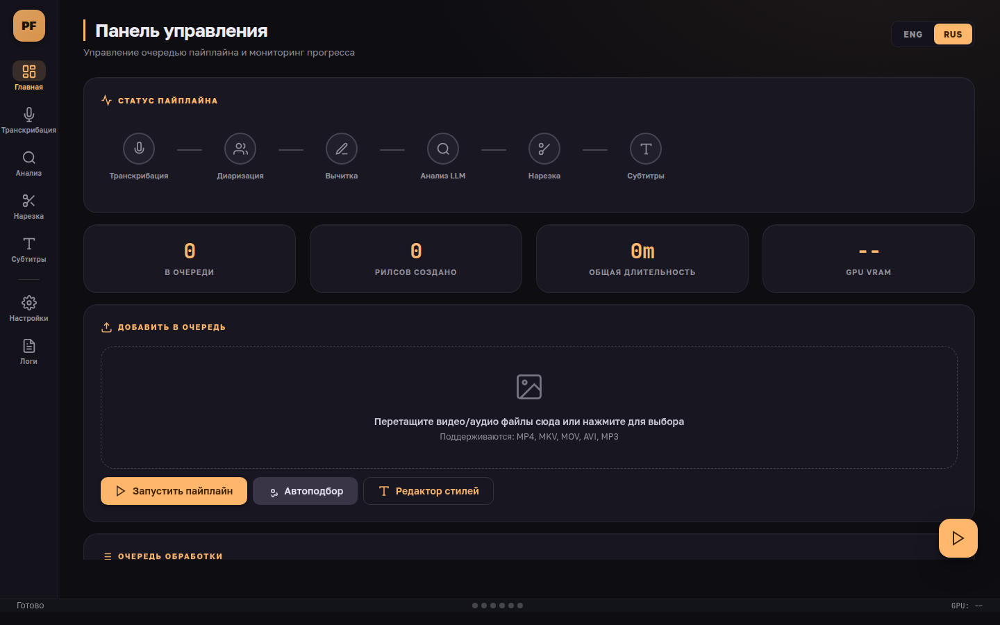
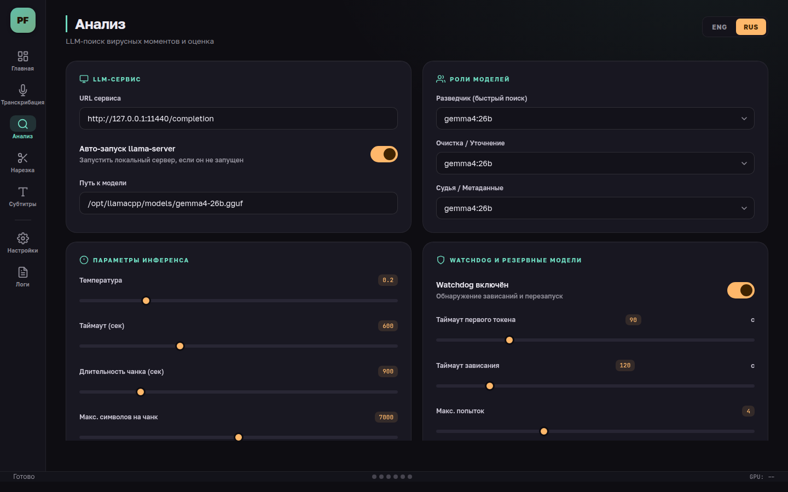
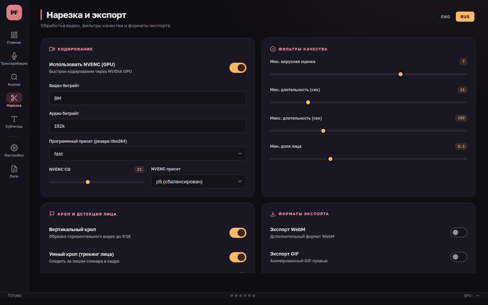
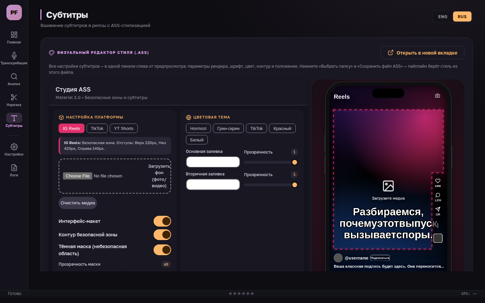

# 🎙️ Podcast Reels Forge

## Автоматическое создание Reels/Shorts из подкастов (локально)

[](https://www.python.org/downloads/)
[](LICENSE)
[](https://xn--80abidn3bem.xn--p1ai/projects/podcast-reels-forge/)
[](https://dalink.to/bormotoon)

[English](README.en.md) | **Русский**

🌐 **Страница проекта:** [педобраз.рф/projects/podcast-reels-forge](https://xn--80abidn3bem.xn--p1ai/projects/podcast-reels-forge/)

---

## 📌 Оглавление

- [Что делает проект](#что-делает-проект)
- [Ключевые особенности](#ключевые-особенности)
- [Быстрый старт](#быстрый-старт)
- [Работа с YouTube](#работа-с-youtube)
- [Режимы запуска под задачи](#режимы-запуска-под-задачи)
- [Как устроен пайплайн](#как-устроен-пайплайн)
- [Где лежат результаты](#где-лежат-результаты)
- [Аргументы командной строки](#аргументы-командной-строки)
- [Конфигурация (config.yaml)](#конфигурация-configyaml)
- [Графический интерфейс (GUI)](#графический-интерфейс-gui)
- [Smart Crop по лицу](#smart-crop-по-лицу)
- [Перегенерация видео](#перегенерация-видео)
- [Производительность и стабильность](#производительность-и-стабильность)
- [Поддержать проект](#поддержать-проект)
- [Лицензия](#лицензия)

---

## Что делает проект

**Podcast Reels Forge** — это мощный CLI-инструмент для автоматического извлечения виральных моментов (Reels, Shorts, TikTok) из длинных подкастов или интервью. Он берет на себя всё — от распознавания речи до финального монтажа.

Основные этапы работы:

1. **Распознавание речи (faster-whisper)**: Преобразование аудио/видео в текст с пословными таймкодами. Модель `large-v3`, два режима — быстрый батчевый и точный с контекстом (см. [Режимы запуска под задачи](#режимы-запуска-под-задачи)). Рядом кладётся `.srt`, разбитый по предложениям — по одной короткой реплике на экран, а не простыня на три-четыре фразы.
2. **Диаризация (Опционально)**: Определение разных спикеров в записи.
3. **Вычитка транскрипта (LLM)**: gemma4 исправляет орфографию и пунктуацию; guardrail отклоняет правки, где модель дописала или пересказала текст.
4. **Лонгрид по эпизоду (LLM)**: gemma4 приводит вычитанный транскрипт в вид читаемой статьи — разделы по смыслу с заголовками и абзацы. Это не пересказ: слова, обороты и лицо автора сохраняются, убираются только слова-паразиты, оговорки и повторы. Три проверки ловят и переписывание своими словами, и дописывание, и сокращение. Если включена диаризация, текст дополнительно разбивается по спикерам, а их имена берутся из самого разговора.
5. **AI Анализ (LLM)**: Staged pipeline `scout → cleanup → judge` на локальной Gemma с проверкой кандидатов против транскрипта: сверка цитат, привязка границ к фразам, аудио-сигналы (громкость/паузы/темп речи) и контекст всего эпизода. Количество клипов масштабируется от хронометража (`clips_per_hour`).
6. **Обработка видео (FFmpeg + NVENC)**: Нарезка клипов, вертикальный кроп (9:16), стабилизированное центрирование по лицам и вшитые караоке-сабы с реальными пословными таймингами. Кодирование на GPU через NVENC (~5× быстрее софтверного).

Подробное руководство: [docs/USER_GUIDE.md](docs/USER_GUIDE.md)

---

## Ключевые особенности

- **Batch-обработка**: Просто положите несколько видео в `input/`, и Forge обработает их по очереди.
- **Два режима транскрибации**: `fast` (батчевый, ~5 мин на час аудио) и `quality` (последовательный с контекстом, точнее на тихих/шумных записях).
- **Защита от галлюцинаций**: Подавление зацикливаний Whisper (бесконечные «Спасибо.» на тишине/музыке) через temperature-ladder, repetition penalty и `condition_on_previous_text`.
- **Ролевой llama.cpp-пайплайн**: Локальный staged flow через **llama.cpp** с Gemma 4 lineup: `gemma4`. Ответы модели ограничены JSON-грамматикой, битый JSON переспрашивается, а упавший чанк не роняет весь анализ.
- **Вычитка транскрипта**: LLM чинит орфографию и пунктуацию перед анализом; проверка по буквенному составу гарантирует, что модель ничего не дописала и не пересказала.
- **Статья по эпизоду**: подробный пересказ с разделами и заголовками (`<имя>.article.md`) — читать удобнее, чем стенограмму. Недостоверные фрагменты помечаются, а не выдаются за проверенные.
- **Клипы, привязанные к реальности**: Цитата каждого кандидата сверяется с тем, что реально сказано; границы клипов снапятся к началу фразы и концу мысли; выдуманные моделью таймкоды отбрасываются.
- **Аудио-сигналы**: Громкость, доля пауз и темп речи на отрезке кандидата измеряются ffmpeg и участвуют в ранжировании — текстовые эвристики не слышат эпизод, эти метрики слышат.
- **Количество клипов от хронометража**: `clips_per_hour: 10` — из полуторачасового эпизода получится ~15 клипов; счётчики типов задают только пропорции.
- **Smart Face Crop**: Автоматическое обнаружение лиц для центрирования кадра при вертикальной нарезке.
- **Аппаратное ускорение**: **CUDA** (ctranslate2) для Whisper и **NVENC** для рендеринга видео. NVENC-сборка ffmpeg определяется автоматически.
- **Устойчивость к зависаниям llama.cpp**: Общий таймаут запроса + автоматические повторы; десятиминутный ступор сервера пайплайн переживает сам.
- **Гибкие типы клипов**: Настройка длительности и пропорций для Stories, Reels, Long Reels и Highlights отдельно.
- **Честная оценка качества**: `evaluate_prompts` умеет считать recall/precision против размеченного вручную golden set (`golden/<эпизод>.json`).
- **Браузерный GUI**: Сборка `config.yaml` и визуальный редактор ASS-субтитров с двуязычным интерфейсом (RU/EN), без сервера — см. [Графический интерфейс (GUI)](#графический-интерфейс-gui).

---

## Быстрый старт

### Требования

- **Python 3.10+**
- **FFmpeg** (должен быть в PATH)
- **llama.cpp (`llama-server`)** (для работы с локальными LLM)
- **NVIDIA GPU** (крайне рекомендуется для производительности)
- **yt-dlp** — опционально, только если забираете материал с YouTube: `pip install -U yt-dlp`

### Установка

1. Клонируйте репозиторий.
2. Создайте виртуальное окружение и установите зависимости:

```bash
python3 -m venv whisper-env
source whisper-env/bin/activate
pip install -r requirements.txt
```

### Подготовка данных

Положите ваши видеофайлы (mp4, mkv, mov) в директорию `input/` — или не кладите ничего и укажите ссылку на YouTube (см. [Работа с YouTube](#работа-с-youtube)). Папка просматривается вместе с подпапками.
*Совет: Если рядом с видео уже есть одноименный `mp3`, Forge использует его. Если `mp3` нет, он автоматически извлечёт аудио из видео в `video.mp3` с битрейтом 320k и продолжит пайплайн как обычно.*

### Запуск

```bash
python3 start_forge.py
```

---

## Работа с YouTube

Материал можно не класть руками, а забрать прямо с YouTube: ролик по ссылке, плейлист целиком или весь канал. Это первая стадия конвейера — `fetch`. Она кладёт файл в `input/youtube/`, и дальше он ничем не отличается от того, что вы скопировали туда сами.

### Что нужно

```bash
./whisper-env/bin/pip install -U yt-dlp
```

`YOUTUBE_API_KEY` — не обязателен. Без него перечисление плейлистов и каналов делает сам yt-dlp: медленнее и без дат публикации до скачивания. С ключом это один быстрый запрос: перечислить канал целиком стоит ~41 единицу из бесплатных 10 000 в сутки. Ключ берётся из `.env` в корне проекта или из окружения; создаётся в Google Cloud Console — включите «YouTube Data API v3», затем Credentials → Create credentials → API key. Доступ только к публичным данным, OAuth не нужен.

### Примеры

```bash
# Один ролик целиком через весь пайплайн
python3 start_forge.py --youtube "https://youtu.be/D6WjXRJt1DA"

# Весь канал, всё кроме нарезки видео
python3 start_forge.py --youtube "@pedobraz" --skip cut

# Плейлист: только скачать и транскрибировать
python3 start_forge.py --youtube "https://www.youtube.com/playlist?list=PL..." --only fetch,transcribe

# Посмотреть, что попадёт в отбор, ничего не скачивая
python3 start_forge.py --youtube "@pedobraz" --yt-limit 5 --yt-list

# Только свежее с начала года, без Shorts (60 секунд — граница по умолчанию)
python3 start_forge.py --youtube "@pedobraz" --yt-since 2026-01-01

# По уже скачанному, ничего не докачивая
python3 start_forge.py --skip fetch
```

Понимаются любые формы ссылки: `watch?v=`, `youtu.be/`, `shorts/`, `live/`, `playlist?list=`, `/@handle`, `/channel/UC…`, старые `/c/` и `/user/`, а также голый `@handle` или id ролика. Если значение начинается с дефиса (`-3LisPanK24` — реальный id), пишите через знак равенства: `--youtube=-3LisPanK24`, иначе argparse примет его за флаг.

### Что не брать никогда

Часть канала может обрабатываться иначе — скажем, подкаст режется из локальных мастеров, а не из ютубовского аудио. Такие ролики перечисляются в `youtube.exclude`:

```yaml
youtube:
  exclude:
    - "PLoXa43IuWqDcGdAQbPvtJy0TzS8cWeIC6"   # ПедОбраз Show
```

Плейлист здесь удобнее перечня id: правило «всё с канала, кроме этого шоу» остаётся верным само по себе, когда в шоу добавляют новый выпуск. Принимаются те же формы, что и в `sources` — плейлист, канал, отдельный ролик.

Исключение сильнее прямой ссылки: ролик из списка не возьмётся, даже если назвать его в `--youtube`. Отсев идёт до лимита, так что `--yt-limit 5` даёт пять подходящих роликов, а не «пять новых, из которых часть выпала».

Разовые исключения — флаг `--yt-exclude` (повторяемый). Он **добавляется** к списку из конфига, а не заменяет его: постоянное правило не должно молча сниматься одной командой.

### Что скачивается

По умолчанию (`youtube.download: audio`) берётся **только аудиодорожка**: час подкаста это ~64 МБ вместо ~1 ГБ, и прогон канала целиком становится посильным по трафику и месту. Нарезать при этом нечего — стадия `cut` для таких эпизодов скажет, что видео нет, и пойдёт дальше; транскрипт, лонгрид и `moments.json` при этом делаются как обычно.

Когда видео всё-таки нужно:

```bash
# Разово: скачать с видео и нарезать
python3 start_forge.py --youtube "https://youtu.be/D6WjXRJt1DA" --yt-video
```

Или поменяйте `youtube.download` в конфиге: `video` — всегда видео, `auto` — видео только тогда, когда в наборе стадий есть `cut`.

Видео ограничено 1080p: на выходе всё равно вертикальный клип шириной 1080, и 4K-исходник — просто занятый диск. Меняется через `youtube.max_height`.

Транскрибация всегда своя: субтитры YouTube не используются, даже когда они есть. На тексте Whisper стоит весь остальной конвейер — вычитка, лонгрид, сверка цитат, вжигание, — и автосабы с их отсутствующей пунктуацией просадили бы всё сразу.

### Имена и повторные запуски

Файл называется по шаблону `ГГГГ-ММ-ДД - Заголовок [id]`, например:

```
input/youtube/2026-07-06 - Что я понял на выпускном… [B8G2ANNBIrU].mp4
output/2026-07-06 - Что я понял на выпускном… [B8G2ANNBIrU]/
```

Дата ставит папки эпизодов в хронологический порядок, id делает имя уникальным и позволяет узнать уже скачанный ролик даже после переименования на YouTube. Рядом остаётся `.info.json` от yt-dlp — заголовок, описание, главы.

Повторный запуск ничего не перекачивает: сначала проверяется файл на диске, затем журнал `input/youtube/.archive.txt`. Благодаря журналу ночной прогон канала берёт только новые выпуски. `--no-skip-existing` обходит обе проверки.

### Когда ролик не скачивается

Одна неудача даёт вторую попытку через другой набор клиентов YouTube. Это лечит реальный случай: у части старых роликов дефолтные клиенты не видят ни одного формата, и ролик выглядит как «This video is not available», хотя API отдаёт его публичным и без ограничений.

Чего повтор не лечит — блокировку правообладателем и региональные ограничения: такой ролик недоступен любому клиенту. Пайплайн скажет об этом и пойдёт дальше; один заблокированный выпуск не роняет прогон всего канала.

Если YouTube сменил что-то ещё, чинить можно конфигом, не трогая код — `youtube.ydl_options` пробрасывает любые опции yt-dlp как есть:

```yaml
youtube:
  ydl_options:
    extractor_args:
      youtube:
        player_client: ["web_safari", "tv", "android"]
```

### Область прогона

Как только источники YouTube заданы — флагом `--youtube` или списком `youtube.sources` в конфиге, — обрабатываются **только** названные ролики. Иначе один запуск с YouTube-ссылкой потянул бы за собой все локальные эпизоды из `input/`, с перекодированием аудио для каждого. Снимается флагом `--yt-all-inputs`. Запуск без единого источника работает как раньше: берёт всё, что найдёт во входной папке, включая подпапки.

---

## Режимы запуска под задачи

Forge можно запускать целиком (полный пайплайн) или только стадию транскрибации. У транскрибации два режима — `fast` (по умолчанию) и `quality`.

| Режим | Когда использовать | Скорость\* |
|---|---|---|
| `fast` (батчевый) | Чистая запись, нужен быстрый черновик | ~5 мин на час аудио |
| `quality` (последовательный, с контекстом) | Тихая/дальняя/шумная запись (диктофон, телефон, зал): чинит несогласованные слова | ~1 ч на час аудио |

\* Ориентир для RTX 5060 Ti 16GB, модель `large-v3`. Режим качества медленнее, потому что обрабатывает сегменты последовательно с языковым контекстом вместо независимых батчей.

### Полный пайплайн (транскрибация → анализ → нарезка с NVENC)

```bash
python3 start_forge.py                     # режим транскрибации берётся из config.yaml
python3 start_forge.py --verbose           # подробные логи
python3 start_forge.py --no-skip-existing  # перезапустить все стадии, игнорируя кэш
```

Режим транскрибации для полного пайплайна задаётся в `config.yaml` → `transcription.mode` (`fast`/`quality`).

### Только транскрибация аудио из `input/`

```bash
# Быстрый режим (по умолчанию)
python3 transcribe_input_audio.py --verbose

# Режим качества + подсказка темы — резко улучшает тихие/шумные записи
python3 transcribe_input_audio.py --verbose --mode quality \
  --initial-prompt "Родительское собрание в школе. Программа, занятия, преподаватели."

# Перетранскрибировать заново, игнорируя кэш
python3 transcribe_input_audio.py --verbose --no-skip-existing
```

> 💡 **Подсказка темы** (`--initial-prompt`) смещает словарь модели к нужной лексике и помогает в обоих режимах. Указывайте контекст конкретной записи.

> 💡 **Чистка аудио** (денойз) на практике **ухудшает** распознавание — Whisper обучен на «грязном» звуке. Прироста добивайтесь режимом качества и подсказкой темы, а не пре-обработкой.

### Перегенерация видео без AI-анализа

```bash
python3 rerender_videos.py --smart-crop-face --replace
```

### Проверка результата

```bash
python3 - <<'PY'
import json; d=json.load(open('output/<stem>/<stem>.json'))
s=d['segments']
print('режим:', d.get('mode'), '| сегментов:', len(s))
PY
```

---

## Как устроен пайплайн

Оркестратор [start_forge.py](start_forge.py) запускает [podcast_reels_forge/pipeline.py](podcast_reels_forge/pipeline.py), который выполняет следующие стадии для каждого файла:

0. **Fetch**: (Если заданы источники YouTube) Ролик, плейлист или канал скачиваются в `input/youtube/` под именем `ГГГГ-ММ-ДД - Заголовок [id]`. Отрабатывает до построения очереди, чтобы прогон сузился до нужных эпизодов.
1. **Transcription**: Используется `faster-whisper` с пословными таймкодами. Выход: `output/<file_stem>/<file_stem>.json` + `.srt`.
2. **Diarization**: (Если включено) Создает `diarization.json` со speaker turns.
3. **Proofread**: gemma4 вычитывает транскрипт (орфография/пунктуация) с guardrail-проверкой каждой правки. Выход: `<file_stem>.proofread.json` + `.srt`; исходный транскрипт не меняется.
4. **Article**: gemma4 пересобирает вычитанный транскрипт в статью: разделы по смыслу, заголовки, абзацы. Проверки объёма и лексики ловят дописывание; не прошедшие фрагменты помечаются в `.article.json`. Выход: `<file_stem>.article.md` + `.json`.
5. **Analyze (Staged)**: Обзор эпизода → scout по чанкам с перекрытием → cleanup (дедуп/слияние) → judge с реальными первыми и последними секундами каждого клипа. Между стадиями — детерминированная валидация: кламп таймкодов, сверка цитат с транскриптом, снап границ к фразам, аудио-замеры. Финальный отбор учитывает квоты типов, пересечения и разнообразие тем. Артефакты — в `output/<file_stem>/<модель>/` (например, `gemma4_26b/`).
6. **Video Processing**: Нарезка клипов на основе финального `moments.json`. Forge вшивает ASS-караоке с реальными пословными таймингами, кладёт рядом `reel_XX.md` и `reel_XX.srt`, а также строит `reels_preview.mp4`.

---

## Где лежат результаты

Внутри директории `output/`:

```text
output/
  my_podcast/
    my_podcast.json            # Транскрипт (сегменты + пословные таймкоды)
    my_podcast.srt
    my_podcast.proofread.json  # Вычитанный транскрипт (его читают анализ и сабы)
    my_podcast.proofread.srt
    my_podcast.article.md        # Статья-пересказ эпизода (для чтения)
    my_podcast.article.json      # Разделы, тайминги и метаданные проверок
    diarization.json           # (Опционально) Информация о спикерах
    gemma4_26b/                # Папка модели анализа
      analysis_manifest.json   # Параметры прогона: квоты, чанки, язык
      episode_context.json     # Обзор эпизода (кэш)
      scout_candidates.json    # Всё, что нашёл scout
      cleaned_candidates.json  # После дедупа, cleanup и аудио-замеров
      moments.json             # Финальный список: score (1-10), priority, quote_match_ratio…
      reels.md                 # Сводка клипов
      reels/                   # Нарезанные .mp4 клипы
        reel_01.srt            # Локальная дорожка субтитров (для справки)
        reel_01.md             # Описание + 5 хештегов
        rejected/              # Клипы, не прошедшие quality_filters
      reels_preview.mp4        # Превью всех клипов одним файлом
```

---

## Аргументы командной строки

Основные флаги для `start_forge.py`:

- `--config <path>`: Путь к конфигу (по умолчанию: `config.yaml`).
- `--verbose`: Подробный вывод всех команд и логов.
- `--quiet`: Режим "только ошибки".
- `--no-skip-existing`: Перезапустить все стадии, даже если файлы уже существуют.
- `--autotune`: Автоматическая подстройка параметров под текущее железо (меньше чанки, больше таймауты).
- `--no-progress`: Отключить прогресс-бар (полезно для логов/CI).
- `--only <этапы>`: Запустить только указанные этапы через запятую. Например: `--only proofread,article`.
- `--skip <этапы>`: Запустить всё, кроме указанных этапов. Например: `--skip cut`.
- `--list-stages`: Показать список этапов по порядку и выйти.

Этапы: `fetch`, `transcribe`, `diarize`, `proofread`, `article`, `analyze`, `cut`. Опечатка в названии — ошибка, а не молчаливый пропуск половины конвейера. Пропущенный этап не мешает остальным: если вычитанный транскрипт уже есть от прошлого запуска, `--only article` возьмёт именно его.

```bash
# Собрать лонгриды по уже готовым транскриптам, ничего не перенарезая
python3 start_forge.py --only article

# Всё, кроме нарезки видео
python3 start_forge.py --skip cut
```

Флаги YouTube (подробнее — в разделе [Работа с YouTube](#работа-с-youtube)):

- `--youtube <URL>`: Ссылка на ролик, плейлист или канал, либо `@handle`. Можно повторять. Значение с ведущим дефисом отделяйте знаком равенства: `--youtube=-3LisPanK24`.
- `--yt-exclude <URL>`: Никогда не брать эти ролики (обычно плейлист). Можно повторять; складывается с `youtube.exclude` из конфига.
- `--yt-list`: Показать отобранные ролики и выйти, ничего не скачивая.
- `--yt-limit <N>`: Взять только N последних.
- `--yt-since <дата>` / `--yt-until <дата>`: Границы даты публикации, `ГГГГ-ММ-ДД`.
- `--yt-min-duration <сек>` / `--yt-max-duration <сек>`: Границы длительности. По умолчанию минимум 60 секунд — отсекает Shorts.
- `--yt-audio-only` / `--yt-video`: Переопределить автовыбор дорожки.
- `--yt-max-height <px>`: Потолок высоты видео (по умолчанию 1080).
- `--yt-cookies <файл>`: Cookies в формате Netscape — для возрастных ограничений и материалов для спонсоров.
- `--yt-all-inputs`: Не сужать прогон до скачанного, обрабатывать всю входную папку.

Скачивание можно запустить и отдельно, без остального конвейера:

```bash
python3 -m podcast_reels_forge.scripts.fetch_youtube --list "@pedobraz"
python3 -m podcast_reels_forge.scripts.fetch_youtube "@pedobraz" --limit 5 --audio-only
```

Флаги отдельного транскрайбера `transcribe_input_audio.py`:

- `--mode <fast|quality>`: Переопределить `transcription.mode` из конфига.
- `--initial-prompt "<текст>"`: Подсказка темы для смещения словаря модели.
- `--verbose` / `--quiet`: Уровень логов.
- `--no-skip-existing`: Перетранскрибировать, даже если JSON уже есть.

---

## Конфигурация (config.yaml)

### Основные секции

- **`transcription`**: Модель Whisper (`large-v3`), устройство (`auto`/`cuda`/`cpu`), язык.
  - `mode`: `fast` (батчевый) или `quality` (последовательный, точнее).
  - `batch_size`: размер батча в режиме fast (по умолчанию 16; при OOM автоматически делится пополам вплоть до CPU).
  - `quality_beam_size`: ширина beam в режиме quality (по умолчанию 10).
  - `initial_prompt`: подсказка темы по умолчанию (можно переопределить флагом `--initial-prompt`).
- **`llama_cpp`**:
  - `roles`: Роль-мэппинг `scout / cleanup_refine / judge_metadata / proofread`.
  - `role_overrides`: Настройки таймаутов, температуры и chunk-size для конкретных ролей.
  - `n_predict`: Бюджет токенов на ответ модели (по умолчанию 4096).
  - `model_overrides`: Легаси-совместимость, не основной путь.
- **`proofread`**: Вычитка транскрипта (вкл/выкл, размер батча, порог схожести guardrail).
- **`processing`**:
  - `clips_per_hour`: Клипов на час общего хронометража (по умолчанию 10; `0` — фиксированные количества из `clips`). Счётчики `clips` при этом задают пропорции типов.
  - `clips`: Длительности и микс типов (`stories`, `reels`, `long_reels`, `highlights`).
  - `analysis`: Тонкая настройка отбора — верификация цитат, снап границ, аудио-сигналы, контекст эпизода/judge, веса скоринга, разнообразие тем. Весь блок опционален; подробности в [docs/CONFIGURATION.md](docs/CONFIGURATION.md).
  - `quality_filters.min_score`: Порог по оценке модели (шкала 1-10; приоритет ранжирования лежит в отдельном поле `priority`).
- **`video`**:
  - `vertical_crop`: Включить/выключить соотношение сторон 9:16.
  - `smart_crop_face`: Включить умное центрирование по лицам.
  - `use_nvenc`: Предпочитать аппаратное кодирование NVIDIA (NVENC). При отсутствии NVENC-сборки ffmpeg автоматически откатывается на libx264.
  - `nvenc_cq`: Целевое качество VBR для NVENC (меньше = лучше; по умолчанию 21).
  - `nvenc_preset`: Пресет NVENC `p1`(быстрее)…`p7`(качественнее), по умолчанию `p5`.
  - `video_bitrate`: Потолок битрейта (для NVENC — ограничение пика VBR).
- **`subtitles`**:
  - `enabled`: Включить генерацию вшитых субтитров формата **ASS** (через фильтр `ass` в ffmpeg).
  - `font`: Путь к файлу шрифта. По умолчанию: `assets/fonts/bignoodletoooblique.ttf`.
  - `ass_style`: Путь к `.ass`-файлу со стилем сабов. По умолчанию: `assets/subtitles/forge_subtitles.ass`. Если файла нет, используется встроенный fallback-стиль.
  - `wrap_words`: Включает перенос сабов по словам. Если выключить, caption будет держаться в одной строке.
  - `max_width_ratio`: Доля кадра под текст — задаёт длину строки. По умолчанию `0.74` (кадр минус поля 140px, которые обходят правую панель кнопок) ≈ 28 символов в строке.
  - `vertical_offset`: Сдвиг реплики в долях высоты кадра поверх `MarginV` из `.ass`-стиля. `0.0` — положение целиком за редактором стиля.
  - `fade_in_duration` / `fade_out_duration`: Плавное появление и исчезновение (тег ASS `\fad`). `0` — выключить. Если сумма длиннее реплики, обе части пропорционально ужимаются.
  - `font_size_px`: Работает только когда `.ass`-файла нет; иначе размер берётся из стиля.
  - Стиль по умолчанию — «вирусные» караоке-подписи: жирный узкий шрифт, толстый чёрный контур вместо тени, заливка `\kf` от белого (ещё не произнесено) к янтарному `#FFD60A` (уже прозвучало), низ по центру над интерфейсом площадки.
  - Удобнее всего настраивать стиль визуально — через [GUI](#графический-интерфейс-gui) (вкладка «Субтитры»). Кнопка «Сохранить файл ASS» пишет стиль прямо в `assets/subtitles/forge_subtitles.ass`, откуда его берёт пайплайн.
  - `word_x_space` / `word_y_space` — легаси: на рендер не влияют, интервалы задаёт `.ass`-стиль (`Spacing` в редакторе).
- **`article`**: Пересказ эпизода статьёй. `enabled` включает стадию; `max_length_ratio` и `max_novel_word_ratio` задают пороги проверок достоверности (подробнее — [docs/CONFIGURATION.md](docs/CONFIGURATION.md)).
- **`diarization`**: Включение и настройка определения спикеров (требуется токен в переменной окружения `PYANNOTE_TOKEN`, см. [`.env.example`](.env.example)). `num_speakers` фиксирует число спикеров, если оно известно — меньше пере-кластеризации на шумных записях.

---

## Графический интерфейс (GUI)

Кроме CLI, в проекте есть полноценный **браузерный GUI** для сборки `config.yaml` и
визуальной настройки субтитров — без сервера, как набор статических страниц.
Тёмная «forge»-тема на дизайн-токенах: янтарный фирменный акцент, свой цвет у
каждой стадии, кириллическая типографика (Golos Text + JetBrains Mono),
полная навигация с клавиатуры и переключение **RU/EN**.



Откройте в браузере [`gui/index.html`](gui/index.html) (двойным кликом или через
файловый сервер). Интерфейс разбит на отдельные страницы по стадиям пайплайна,
у каждой свой цветовой акцент:

| Страница | Назначение |
|---|---|
| **Главная** | Очередь файлов, запуск пайплайна (демо), статус стадий |
| **Транскрибация** | Модель Whisper, режим `fast`/`quality`, beam/batch, защита от галлюцинаций |
| **Анализ** | llama.cpp-сервис и тюнинг VRAM, роли моделей, watchdog, переопределения по ролям |
| **Нарезка** | NVENC/кодирование, фильтры качества, smart-crop, типы клипов и количество |
| **Субтитры** | Параметры рендера + встроенный **визуальный редактор ASS-стиля** с превью на «телефоне» |
| **Настройки** | Пути, кэш, диаризация, CLI-флаги и **живой предпросмотр `config.yaml`** |
| **Логи** | Консольный вывод стадий |

| [](docs/images/gui-analyze.png) | [](docs/images/gui-cut.png) |
|---|---|
| Анализ: LLM-сервис, роли моделей, инференс | Нарезка: кодирование, фильтры качества, клипы |



Все настройки покрывают конфиг пайплайна **один-в-один**: на странице «Настройки»
жмёте «Экспорт config.yaml» и кладёте файл в корень проекта. Встроенный редактор
субтитров (вкладка «Субтитры») сохраняет стиль в `assets/subtitles/forge_subtitles.ass` —
именно его читает стадия рендера. Состояние формы хранится в `localStorage` браузера.

> Отдельный standalone-редактор стиля по-прежнему доступен в
> [`assets/subtitles/style-editor.html`](assets/subtitles/style-editor.html).

---

## Smart Crop по лицу

При включении `smart_crop_face: true` в конфиге:

1. С каждого клипа берется несколько кадров-семплов.
2. Лица детектируются через **MediaPipe Face Detection** на нескольких точках клипа.
3. Если лица найдены, окно 9:16 смещается с медианным сглаживанием, чтобы спикер не "плавал" по кадру.
4. Если лица не найдены, используется стабильный центр-кроп с явным логом о fallback.

---

## Перегенерация видео

Если вы хотите изменить параметры видео (битрейт, кроп, отступы) без повторного долгого AI-анализа, используйте [rerender_videos.py](rerender_videos.py):

```bash
# Перерендерить всё с включенным smart crop
python3 rerender_videos.py --smart-crop-face --replace
```

---

## Производительность и стабильность

- **Whisper (память)**: При OOM `batch_size` автоматически делится пополам (16 → 8 → … → CPU), так что падения не будет — просто медленнее. Чтобы ускорить, освободите VRAM или уменьшите `batch_size`.
- **Whisper (качество)**: Несогласованные слова и ошибки на тихой/дальней записи лечатся режимом `quality` + `--initial-prompt`, а **не** чисткой аудио (денойз ухудшает распознавание).
- **GPU Blackwell (RTX 50xx)**: Требуется `torch>=2.7` со сборкой под CUDA 12.x. Предупреждение PyTorch о `sm_120` безвредно — инференс Whisper идёт через ctranslate2, а не через ядра PyTorch.
- **ffmpeg / NVENC**: Forge ищет NVENC-сборку ffmpeg автоматически (`/usr/local/bin`, `/usr/bin`); путь можно задать через переменную окружения `FORGE_FFMPEG`. Если NVENC недоступен — кодирование идёт на CPU (libx264).
- **llama.cpp**: Зависшие запросы обрываются по общему таймауту (`llama_cpp.timeout`, per-role в `role_overrides`) и автоматически повторяются; один упавший чанк не роняет анализ эпизода. Битый JSON переспрашивается (`processing.analysis.json_retry`).
- **Ориентир по времени** (RTX 5060 Ti 16GB, эпизод ~2 часа): транскрибация + вычитка ~28 мин, анализ ~9 мин, нарезка ~18 мин. Рост `clips_per_hour` пропорционально удлиняет анализ и нарезку.

---

## Поддержать проект

Forge бесплатен и работает полностью локально. Если он экономит вам часы монтажа — поддержите разработку:

[](https://dalink.to/bormotoon)

---

## Лицензия
